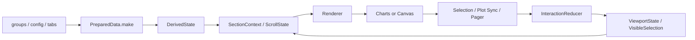

# CombinedChartFramework Architecture

[简体中文](Architecture.md) | English

This document describes the repository based on the codebase state on 2026-03-10.  
Its purpose is to distinguish clearly between:

1. what the repository implements today
2. what the final `ChartKit` architecture, defined in `Arch.md`, must support

## 1. Executive Summary

The repository is currently a chart framework codebase organized as:

- a Swift Package that ships `CombinedChartFramework`
- a Sample App used for demo, feature validation, UI debugging, and snapshot testing

The current delivered chart component is `CombinedChartView`, which already supports:

- stacked bar rendering
- aggregated trend line rendering
- point selection and selection highlighting
- paging and horizontal navigation
- dual rendering engines: `Charts` and `Canvas`
- dual interaction implementations: SwiftUI gesture and UIKit `UIScrollView`

Architecturally, this is no longer a throwaway demo. It already contains a recognizable vertical slice with:

- public API
- data normalization
- derived state
- reducer-driven interaction logic
- renderer abstraction
- supporting UI components

However, it is still not the final `ChartKit` platform. The current codebase is best understood as the first generation of a `CombinedChart` component that must evolve into a reusable multi-chart architecture.

## 1.1 End-State Architecture Goal

According to `Arch.md`, the end-state is not a more complicated `CombinedChartView`.  
The end-state is a modular `ChartKit` that must support:

- `CombinedChart`
- `LineChart`
- `BarChart`
- `PieChart`
- `AreaChart`
- `CandlestickChart`

The target architecture must satisfy the following rules:

- the Sample App is only for demo, debugging, crash reproduction, and feature validation
- core chart logic lives inside the package
- shared foundations live in `Foundation`
- each chart type has its own component module under `Components/<ChartType>/`
- reusable UI is extracted into `SharedUI`
- version-specific behavior and workarounds are isolated in `Compatibility`

All architectural recommendations in this document are based on that target state.

## 2. Current Positioning

Today, the repository is closer to:

- a reusable `CombinedChart` component
- an early chart framework implementation for SwiftUI
- a framework-in-progress supported by a sample app and snapshot tests

It is not yet a mature multi-chart platform.

## 2.1 Current vs Target Architecture

The current codebase mainly uses folder-level separation inside a single delivered target:

- `Public`
- `Core`
- `Interaction`
- `Rendering`
- `Support`
- `Preview`

The target architecture from `Arch.md` requires package-level or target-level separation:

- `Foundation`
- `Components`
- `SharedUI`
- `Compatibility`

So the current state is best described as:

- a single-target architecture with reasonable internal layering

while the target state is:

- a multi-layer reusable chart platform

## 3. Repository Responsibilities

### 3.1 Top-Level Structure

The repository currently consists of:

1. `Package.swift`
2. the sample app tree under `CombinedChartSample/`
3. tests and documentation

### 3.2 Package Responsibility

The Swift Package exposes one library product:

- `CombinedChartFramework`

Its sources currently point into:

- `CombinedChartSample/CombinedChartSample/Sources/CombinedChartFramework`

That is acceptable as an intermediate step, but it is not the desired long-term package layout for `ChartKit`.

### 3.3 Sample App Responsibility

The Sample App currently handles:

- sample data loading
- demo UI
- debug controls
- interaction validation
- snapshot test scenarios

This mostly matches the desired architecture rule that the app should demonstrate and validate the framework without owning core chart logic.

### 3.4 Test Responsibility

The current test strategy already has two layers:

- unit tests for framework logic
- UI snapshot tests for visual regression

This is a good foundation for a reusable chart library.

## 4. Current Logical Layering

The framework sources can currently be grouped into six logical layers:

| Current Layer | Role |
| --- | --- |
| `Public/` | public API, public models, configuration types |
| `Core/` | models, derived state, math, data preparation, state calculation |
| `Interaction/` | reducers, snapshots, layout coordination, scroll handling |
| `Rendering/` | rendering contexts, engine selection, overlay logic |
| `Support/` | shared UI pieces such as axis labels and pager UI |
| `Preview/` | preview helpers |

This is healthy for the current stage because:

- the public surface is separated from internals
- state calculation is not fully embedded in SwiftUI views
- rendering is not mixed directly into the entry view
- interaction is already modeled through reducer-like flows

## 4.1 Mapping Current Layers to the Target Architecture

From the perspective of `Arch.md`, the current layers map to the target architecture like this:

| Current Layer | Target Layer | Architectural Interpretation |
| --- | --- | --- |
| `Core/` | `Foundation/` | pure models, state, math, and algorithms should move here |
| `Interaction/` | `Foundation/Interaction` + `Compatibility/` | pure interaction logic belongs in foundation, platform bridging belongs in compatibility |
| `Rendering/` | `Components/<Chart>/Renderer` + `SharedUI/Overlay` | chart-specific rendering and reusable overlay concerns should be split |
| `Support/` | `SharedUI/` | axis, legend, pager, tooltip-like UI should become reusable shared UI |
| `Public/` | `Components/<Chart>/Public API` | each chart should own its own public API surface |

This mapping is the key bridge between the current implementation and the desired `ChartKit` structure.

## 5. Core Public Model

### 5.1 Input Model

The current input model revolves around:

- `ChartSeriesKey`
- `ChartPoint`
- `ChartGroup`
- `ChartPointID`

Strengths of the current model:

- strongly typed identifiers
- stable point identity via `groupID + xKey`
- value semantics for data input

These are good properties for maintaining selection state and supporting deterministic tests.

### 5.2 Presentation Model

The public presentation-facing abstractions include:

- `ChartTab`
- `ChartPresentationMode`
- `SelectionContext`
- `SelectionOverlayContext`
- `PagerContext`
- `ViewSlots`

These abstractions are valuable because they expose extension points without leaking internal rendering state.

### 5.3 Configuration Model

`ChartConfig` is the main configuration aggregator today. It currently includes:

- `Rendering`
- `Bar`
- `Line`
- `Axis`
- `Pager`
- `Debug`

This is one of the strongest parts of the current design because it centralizes behavior, visuals, and rendering choices into a value-based configuration object.

That said, the target architecture in `Arch.md` expects each chart type to eventually expose its own:

- `Configuration`
- `Style`
- `Renderer`

So the current `ChartConfig` should be treated as an intermediate consolidated configuration model, not the final multi-chart API shape.

## 6. Runtime Flow

The current `CombinedChartView` runtime flow can be summarized like this:

### 6.1 Data Preparation

`PreparedData.make(from:)` is responsible for:

- sorting groups by `groupOrder`
- flattening point collections
- generating stable point ID arrays
- generating axis point descriptors

This is the right kind of normalization step for a reusable chart system.

### 6.2 Derived State

`DerivedState` handles:

- empty-state detection
- y-domain calculation
- y-axis tick generation
- display domain generation
- pager state derivation
- visible start calculation

This is important because it keeps rendering dependent on resolved state instead of embedding data math in SwiftUI view composition.

### 6.3 Layout and Scroll Context

`SectionContext`, `ScrollState`, `LayoutMetrics`, and `DragState` together handle:

- viewport sizing
- unit width calculation
- chart width calculation
- current offset calculation
- drag settle target calculation

This is the highest-complexity part of the current implementation and one of the most important areas for future foundation extraction.

### 6.4 Rendering

`Renderer` is responsible for:

- building axis, marks, and overlay contexts
- selecting the rendering engine
- delegating actual rendering to `Charts` or `Canvas`

This separation is already aligned with the design rule that the view should orchestrate, not own rendering details.

### 6.5 Interaction Loop

User actions are modeled through `ViewAction`, reduced through `InteractionReducer`, and applied through mutations and commands to:

- `viewportState`
- `visibleSelection`

This is a lightweight single-direction architecture and is one of the best candidates for long-term foundation reuse.

## 7. Rendering Architecture Assessment

### 7.1 Dual Rendering Engines

The current design supports:

1. a `Charts` rendering path
2. a `Canvas` rendering path

This is a pragmatic architecture choice:

- `Charts` provides stronger platform integration
- `Canvas` provides more manual control and a compatibility fallback

### 7.2 Benefits

- higher resilience across versions
- explicit control over compatibility behavior
- the ability to isolate renderer-specific bugs

### 7.3 Costs

- duplicate semantics across renderers
- higher parity testing cost
- increased regression surface

The long-term architecture should not keep both engines as equal peers forever. The platform needs a clear definition of:

- primary renderer
- compatibility renderer

## 8. Interaction Architecture Assessment

### 8.1 Dual Horizontal Interaction Paths

The current implementation supports:

- a SwiftUI gesture-driven path
- a UIKit scroll-view-backed path

This is driven by practical platform differences rather than abstraction purity.

### 8.2 Benefits

- stronger control over content offset where needed
- practical fallback for different system behaviors
- easier comparison of interaction behavior during debugging

### 8.3 Costs

- more state synchronization complexity
- more edge cases across implementations
- more expensive regression testing

The architecture should eventually converge on a single source of truth for visible position, regardless of which interaction path is active.

## 9. Quality and Test Status

The current unit tests already cover important logic areas such as:

- derived state
- viewport and paging state
- selection resolution
- line and bar resolver logic
- reducer behavior

The repository also includes snapshot tests for representative chart states.  
This is already the correct direction for a framework-quality chart system.

## 9.1 Current Structural Issue Confirmed During Validation

The current package state still has a platform-boundary issue:

- `Package.swift` declares `macOS(.v14)`
- a UIKit-backed interaction file imports UIKit directly

As a result, package builds through `swift test` on macOS fail in the current state.  
This is not just a build inconvenience. It is an architectural consistency issue that affects trust in platform claims.

## 10. Architectural Strengths

The current implementation has several important strengths worth preserving:

- a clear entry-point-oriented public API
- a strong value-based configuration model
- separation between state derivation and view composition
- reducer-style interaction modeling
- extensibility through contextual slots rather than layout duplication
- clear potential to extract foundation-level logic from current `CombinedChartView` internals

## 11. Main Architectural Gaps

### 11.1 Layering Is Still Folder-Based, Not Module-Based

The current architecture relies on conventions inside one delivered target.  
That is not enough for a long-term multi-chart platform.

### 11.2 Shared Logic Is Still Namespaced Under `CombinedChartView`

Objects such as:

- `PagerState`
- `SelectionResolver`
- `DragState`
- `DerivedState`

already look like future foundation primitives, but they still live under a chart-specific namespace.

That will eventually become a blocker because the target platform requires new chart types to be added without modifying old ones.

### 11.3 Compatibility Is Not Yet a Real Layer

UIKit and version-specific behavior are still too close to component internals.  
`Compatibility` exists as a target architecture concept, but not yet as a real isolated layer.

### 11.4 Multiple Implementation Paths Increase Regression Pressure

The current design maintains:

- `Charts` vs `Canvas`
- SwiftUI gesture vs UIKit scroll view

This creates a four-path behavioral matrix that must be managed deliberately.

### 11.5 The Package Layout Is Still Transitional

The current package reuses sources from within the sample app project tree.  
That is functional today but not ideal for a durable framework repository.

## 12. Recommended Evolution Path

### Phase 1: Establish Real Modular Boundaries

The first real architecture milestone should be splitting the current implementation into:

- `Foundation`
- `Components/CombinedChart`
- `Components/LineChart`
- `Components/BarChart`
- `Components/PieChart`
- `SharedUI`
- `Compatibility`

Pure algorithms and state logic should move into `Foundation` first, with as little SwiftUI dependence as possible.

### Phase 2: Align Platform Claims with Compatibility Reality

If the repository keeps macOS support in the package declaration, it must also provide real compatibility isolation for UIKit-dependent paths.  
Otherwise platform support should be narrowed until the compatibility layer is real.

### Phase 3: Unify Rendering Semantics

The platform should introduce shared upper-layer rendering semantics for:

- bar segments
- line segments
- selection geometry
- axis layout descriptors

That way, renderers become implementation backends rather than separate business interpretations of chart state.

### Phase 4: Extract Shared Capabilities Out of `CombinedChartView`

Capabilities such as:

- paging
- selection mapping
- viewport state
- domain and tick calculation
- drag-settle policy

should move out of chart-specific namespacing and into reusable foundation structures.

### Phase 5: Expand to the Multi-Chart Platform

Only after the previous phases are complete should the repository expand confidently toward the full chart family:

- `CombinedChart`
- `LineChart`
- `BarChart`
- `PieChart`
- `AreaChart`
- `CandlestickChart`

## 13. Conclusion

The repository is already beyond demo quality. It has the core ingredients of a real framework:

- a public API
- structured internal layering
- renderer abstraction
- reducer-like interaction logic
- test coverage

But it is still in the middle of the journey from a single delivered chart component to a real `ChartKit` platform.

The next stage should focus on three foundational priorities:

1. modularization
2. platform-boundary cleanup
3. semantic unification across renderers and interaction paths

Once those are in place, expanding to the broader chart family becomes an architecture win instead of a multiplication of technical debt.
