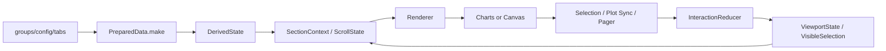

# CombinedChartFramework 架构说明

[English](Architecture.en.md) | 简体中文

本文基于仓库在 2026-03-10 的实际代码结构编写，关注“当前实现是什么、为什么这样设计、下一步应该如何演进”，而不是仅描述目标愿景。

## 1. 执行摘要

当前项目本质上是一个采用 `Swift Package + Sample App` 组织方式的图表组件仓库，核心交付物是 `CombinedChartFramework`，当前只落地了一个组合图组件 `CombinedChartView`，支持：

- 多序列堆叠柱状图
- 聚合趋势线
- 点选中与选择态高亮
- 分页与横向滚动
- `Charts` / `Canvas` 双渲染引擎
- SwiftUI 手势滚动 / UIKit `UIScrollView` 双交互实现

从架构角度看，这个项目已经具备较强的“单组件垂直切片”特征：公共 API、数据预处理、派生状态、交互 reducer、渲染器和支持性 UI 已经分离，且有一定测试覆盖。  
但它尚未完成从“单一 CombinedChart 组件”向“通用 ChartKit 平台”的彻底演进，尤其在模块边界、平台隔离、渲染策略复用和多图表扩展能力上仍然存在明显提升空间。

## 1.1 终态架构目标（对齐 Arch.md）

根据根目录 `Arch.md`，本仓库的终态目标不是继续堆叠单一 `CombinedChartView` 能力，而是演进为可扩展的 `ChartKit`。  
最终架构必须支持以下图表族：

- `CombinedChart`
- `LineChart`
- `BarChart`
- `PieChart`
- `AreaChart`（后续扩展）
- `CandlestickChart`（后续扩展）

终态架构必须满足以下约束：

- Sample App 只负责 demo、验证和调试
- 核心逻辑全部进入 ChartKit Package
- 公共基础能力沉淀到可复用的 `Foundation`
- 每一种图表都是独立的 `Components/<ChartType>/`
- 共享 UI 集中在 `SharedUI`
- 版本兼容与 workaround 集中在 `Compatibility`

这意味着我们写文档时必须清楚区分两件事：

1. 当前仓库已经实现了什么
2. 最终目标架构必须支持到什么程度

本文后续所有“建议演进”均以这个终态目标为准，而不是仅服务当前 `CombinedChart` 这一条产品线。

## 2. 项目定位

### 2.1 当前定位

当前仓库更接近：

- 一个可发布的 `CombinedChart` 组件
- 一个面向 SwiftUI 的图表框架雏形
- 一个带 Sample App 与截图测试的演示/验证工程

而不是一个已经成熟的多图表平台。

### 2.2 与目标架构的关系

仓库根目录的 `Arch.md` 描述了未来 `ChartKit` 形态，强调：

- `Foundation`
- `Components`
- `SharedUI`
- `Compatibility`

四层模块化设计。

对照当前代码，项目已经在“目录层面”形成了类似雏形，但尚未在 Swift Package target 级别完成真正的模块拆分。现状更多是“单 target 内的逻辑分区”，而不是“独立编译边界下的架构分层”。

进一步说，当前仓库最接近的是：

- 一个面向 `CombinedChart` 的第一代实现

而终态目标应是：

- 一个面向多图表家族的 `ChartKit` 平台

这是本文所有架构判断的基本前提。

## 3. 仓库结构与职责分工

### 3.1 顶层结构

当前仓库由三部分组成：

1. `Package.swift`
2. `CombinedChartSample/` 下的 Sample App 与框架源码
3. 测试与文档

### 3.2 关键职责边界

#### Swift Package

`Package.swift` 暴露了一个库产品：

- `CombinedChartFramework`

其源码路径指向：

- `CombinedChartSample/CombinedChartSample/Sources/CombinedChartFramework`

说明当前 Package 只是复用 App 工程目录中的框架代码，而不是独立的 package source root。这种组织方式在早期阶段可接受，但长期会增加工程边界模糊度。

#### Sample App

Sample App 主要承担：

- 数据样例加载
- 参数调试
- 交互验证
- 快照测试承载

当前 Sample App 基本没有承载框架核心算法，这一点符合良好边界原则。核心业务逻辑仍然集中在 `CombinedChartFramework` 下。

#### Tests

测试分为两层：

- 框架单元测试：`CombinedChartFrameworkTests`
- UI 快照测试：`CombinedChartSampleUITests`

这说明项目已经开始构建“算法正确性 + 视觉稳定性”的双层质量保障体系。

## 4. 当前逻辑分层

框架源码当前可归纳为六个逻辑层次：

| 层次 | 目录 | 主要职责 |
| --- | --- | --- |
| Public | `Public/` | 对外 API、公共模型、配置对象 |
| Core | `Core/` | 数据模型、派生状态、滚动/拖拽计算、解析器 |
| Interaction | `Interaction/` | 交互快照、reducer、section 容器、滚动协调 |
| Rendering | `Rendering/` | 渲染上下文、Charts/Canvas 双引擎、Overlay 逻辑 |
| Support | `Support/` | Y 轴标签、Pager 等共享 UI 片段 |
| Preview | `Preview/` | 预览支持 |

这是一个比较健康的“单 target 分层”结构，具备以下优点：

- API 层与内部实现层分离
- 纯计算逻辑与 View 层有一定隔离
- 渲染逻辑已独立于主视图
- 交互行为通过 reducer 建模，便于测试

### 4.1 当前分层到终态分层的映射

从 `Arch.md` 的终态设计看，当前目录结构可以视为目标架构的前置形态：

| 当前目录分层 | 终态应归属的层 | 说明 |
| --- | --- | --- |
| `Core/` | `Foundation/` | 纯模型、计算、状态、算法应整体下沉到基础层 |
| `Interaction/` | `Foundation/Interaction` + `Compatibility/` | 纯交互策略保留在基础层，平台桥接迁入兼容层 |
| `Rendering/` | `Components/<Chart>/Renderer` + `SharedUI/Overlay` | 图表专属绘制与共享 overlay 需要拆开 |
| `Support/` | `SharedUI/` | 轴、pager、tooltip、legend 应成为可复用 UI |
| `Public/` | `Components/<Chart>/Public API` | 当前公共入口未来应拆为每个图表独立公共面 |

这张映射表非常关键，因为它回答了“当前代码将来应该往哪里迁”的问题。

## 5. 核心领域模型

### 5.1 输入模型

对外输入的核心模型包括：

- `ChartSeriesKey`
- `ChartPoint`
- `ChartGroup`
- `ChartPointID`

其特点是：

- 采用强类型标识序列
- 用 `groupID + xKey` 形成稳定点位身份
- 允许业务层以 value type 方式构建图表数据

这为选择态保持、重排后匹配和测试构造提供了良好基础。

### 5.2 展示模型

展示层的公共抽象主要包括：

- `ChartTab`
- `ChartPresentationMode`
- `SelectionContext`
- `SelectionOverlayContext`
- `PagerContext`
- `ViewSlots`

这些类型使组件具备以下能力：

- 同一份数据在不同展示模式间切换
- 以 slot/context 方式开放局部 UI 定制
- 将“行为上下文”显式传递给外部调用方

这是一种比简单闭包更成熟的 API 设计方式，因为它保持了扩展点的语义完整性。

### 5.3 配置模型

`ChartConfig` 是当前最重要的配置聚合对象，内部进一步划分为：

- `Rendering`
- `Bar`
- `Line`
- `Axis`
- `Pager`
- `Debug`

其架构价值主要体现在：

- 值语义配置，避免共享可变状态
- 把样式、行为、渲染策略集中在一处
- 支持测试、预览、特性开关和外部组合

这一点是当前代码最接近“框架级设计”的部分。

## 6. 运行时架构与数据流

当前 `CombinedChartView` 的运行时主链路可以概括为：

### 6.1 数据预处理阶段

`PreparedData.make(from:)` 负责：

- 对分组按 `groupOrder` 排序
- 扁平化所有点位
- 生成 `dataPointIDs`
- 生成 axis point infos

这是一个典型的数据规范化步骤。它的意义在于把业务输入转换成渲染与交互都能直接消费的中间形态，避免后续链路反复遍历原始结构。

### 6.2 派生状态阶段

`DerivedState` 负责：

- 计算 `hasData`
- 计算 Y 轴 domain
- 生成 Y 轴 ticks
- 计算显示用 domain
- 生成分页相关 `PagerState`
- 推导可见起始点及其标签

这层的价值非常关键：  
它把“图表如何显示”从 View 组合逻辑中拿出来，沉淀为确定性计算过程，使渲染层只消费结果而不参与业务判断。

### 6.3 布局与滚动上下文阶段

`SectionContext`、`ScrollState`、`LayoutMetrics` 和 `DragState` 共同完成：

- viewport 宽度计算
- unit width 计算
- chart width 计算
- current offset / target offset 计算
- 拖拽后收敛目标计算

这一层是图表交互正确性的核心，也是项目复杂度最高的部分之一。

### 6.4 渲染阶段

`Renderer` 负责：

- 构造 axis/marks/overlay 三类上下文
- 决定渲染引擎
- 输出 `Charts` 或 `Canvas` 视图树

这说明当前架构已经明确区分：

- 数据与状态准备
- 渲染决策
- 具体绘制执行

这是健康的图形组件架构特征。

但按照终态目标，这一链路未来应进一步演进为：

- `Foundation` 负责数据、domain、visible range、selection mapping、downsampling
- `Components/<Chart>` 负责 chart-specific renderer、style、configuration、view
- `SharedUI` 负责轴、图例、tooltip、overlay 等共享展示能力
- `Compatibility` 负责 iOS 16 workaround 与版本能力封装

也就是说，当前链路已经具备轮廓，但尚未形成真正可扩展的多图表平台级装配结构。

### 6.5 交互闭环

交互动作通过 `ViewAction` 建模，交给 `InteractionReducer` 处理，生成：

- `InteractionMutation`
- `InteractionCommand`

随后由 coordinator 应用到：

- `viewportState`
- `visibleSelection`

并在需要时触发：

- `onPointTap`

这是一个轻量级的单向数据流实现。虽然没有引入完整状态管理框架，但核心思想已经接近 reducer-driven architecture。

## 7. 渲染架构评估

### 7.1 双渲染引擎设计

当前项目支持两条渲染路径：

1. `Charts` 渲染路径
2. `Canvas` 渲染路径

该设计的合理性在于：

- `Charts` 路径更贴近平台能力，适合较新系统
- `Canvas` 路径提供更底层的绘制控制，适合作为兼容和兜底方案

### 7.2 Charts 路径特征

`Charts` 路径的优势：

- 更强的平台集成度
- 更容易利用 `ChartProxy`
- Overlay 能天然使用坐标映射

缺点：

- 对平台版本和框架行为差异更敏感
- 某些复杂交互和视觉一致性更依赖系统实现

### 7.3 Canvas 路径特征

`Canvas` 路径的优势：

- 绘制控制力更强
- 行为更可预测
- 便于在平台差异较大时手动兜底

缺点：

- 需要手动维护坐标换算、点击映射和标签绘制
- 与 `Charts` 路径存在行为一致性成本

### 7.4 架构判断

从架构师视角，这是一种典型的“主引擎 + 兼容引擎”设计。  
它提升了鲁棒性，但也引入了长期维护成本：

- 双份渲染行为必须持续校准
- 视觉与交互语义容易发生漂移
- 测试矩阵会显著增大

因此，未来必须为两条路径建立明确的主次关系，而不能长期把二者都当作等权实现。

## 8. 交互与滚动架构评估

### 8.1 双滚动实现

当前项目支持两种水平滚动实现：

- SwiftUI `DragGesture`
- UIKit `UIScrollView`

这背后的架构动机很明确：  
SwiftUI 原生滚动观测与收敛能力在某些场景下不够稳定，因此通过 UIKit 下沉获得更真实的 `contentOffset` 与减速行为控制。

### 8.2 优点

- 能覆盖不同系统能力差异
- 可在 UIKit 模式下获得更准确的滚动状态
- 便于验证不同实现的体验差异

### 8.3 风险

- 交互状态同步链路更复杂
- SwiftUI 与 UIKit 行为可能不完全一致
- 调试成本和回归成本明显上升

当前 `DebugState` 的设计是合理的，它让滚动相关关键指标可观测，这对解决此类复杂交互问题非常必要。

## 9. 可测试性与质量现状

### 9.1 已具备的测试能力

当前单元测试覆盖了几类关键逻辑：

- `DerivedState`
- `PagerState`
- `InteractionReducer`
- `SelectionResolver`
- `LineSegmentResolver`
- `BarSegmentResolver`

这说明团队已经把最容易出错、又最适合纯函数化测试的部分优先沉淀了下来。

### 9.2 UI 质量保障

`CombinedChartSampleUITests` 已经具备快照测试，覆盖了至少两类场景：

- 默认 total trend
- breakdown + by page

对于图表组件来说，快照测试是非常重要的，因为很多问题不是逻辑错，而是视觉回归。

### 9.3 当前验证发现的架构问题

在 2026-03-10 对仓库执行 `swift test` 验证时，Package 构建失败，失败原因不是测试断言，而是平台边界问题：

- `Package.swift` 声明支持 `macOS(.v14)`
- 但 `CombinedChartView+UIKitScrollContainer.swift` 无条件 `import UIKit`

这意味着当前 Package 的“平台声明”和“源码实现”并不一致。  
从架构上说，这不是一个小问题，因为它会影响：

- Package 可移植性
- CI 可构建性
- 平台兼容承诺的可信度

## 10. 架构优势

当前设计中最值得保留的部分有：

### 10.1 单入口 API 清晰

`CombinedChartView` 作为唯一主入口，配合 view-scoped typealias，降低了外部调用复杂度。

### 10.2 配置模型成熟

`ChartConfig` 的分域设计比较完整，是未来抽象成通用图表框架的重要基础。

### 10.3 状态计算与渲染分离

`PreparedData`、`DerivedState`、`ScrollState`、`Renderer` 的分工明确，减少了 SwiftUI View 中的逻辑堆积。

### 10.4 交互逻辑具备 reducer 化趋势

这让复杂滚动和分页逻辑有机会持续被测试覆盖，而不会退化为分散在各处的临时状态修改。

### 10.5 外部定制点设计合理

`slots`、`PagerContext`、`SelectionOverlayContext` 体现了“框架保留骨架、业务自定义局部内容”的正确扩展思路。

### 10.6 已具备向多图表基础层抽象的潜力

`PagerState`、`SelectionResolver`、`DragState`、`DerivedState` 这类对象虽然目前仍挂在 `CombinedChartView` 下，但从职责上看已经非常接近 `Arch.md` 中要求的 Foundation 能力。

## 11. 主要架构问题

### 11.1 分层仍然停留在目录级，而非模块级

当前 `Public/Core/Interaction/Rendering/Support` 是逻辑分层，不是编译分层。  
这意味着：

- 内部边界主要靠约定维持
- 平台依赖容易向上渗透
- 后续多图表共享能力难以通过 target 复用

### 11.2 组件与框架能力耦合

很多抽象仍以 `CombinedChartView` 为命名根，例如：

- `CombinedChartView.DerivedState`
- `CombinedChartView.ScrollState`
- `CombinedChartView.InteractionReducer`

这适合当前单组件阶段，但不利于未来抽出通用 foundation 能力。

更重要的是，这会阻碍终态目标中“新增图表时不得修改已有组件”的原则落地。  
如果基础能力继续绑定在 `CombinedChartView` 命名空间下，后续新增 `LineChart`、`BarChart`、`PieChart` 时，很容易被迫回头修改旧组件。

### 11.3 平台兼容边界缺失

UIKit 代码直接进入主 target，说明 `Compatibility` 层尚未形成。

### 11.4 双实现带来的行为一致性成本高

当前同时维护：

- `Charts` / `Canvas`
- SwiftUI Gesture / UIKit ScrollView

这会形成 2 x 2 的行为矩阵。若没有更系统的自动化验证，后续回归风险会持续扩大。

### 11.5 Sample 工程与 Package 目录复用方式偏早期

框架源码嵌在 App 工程目录中，可工作，但不适合作为长期稳定的库仓库布局。

## 12. 建议的演进路线

### 阶段一：完成真正的模块隔离

建议先把现有单 target 拆成最小可行模块：

- `Foundation`
- `Components/CombinedChart`
- `Components/LineChart`
- `Components/BarChart`
- `Components/PieChart`
- `SharedUI`
- `Compatibility`

优先把纯算法和状态模型抽到 `Foundation`，做到不依赖 `SwiftUI` 或尽量少依赖 `SwiftUI`。

### 阶段二：收敛平台声明与兼容实现

若保留 `macOS` 声明，则应：

- 对 UIKit 容器进行条件编译
- 为 macOS 提供替代滚动实现
- 或者下调 Package 平台声明，仅声明当前真正支持的平台

这一步是构建稳定性的基础。

### 阶段三：统一渲染抽象

建议将公共绘制语义抽象成中间层，例如：

- bar segments
- line segments
- selection geometry
- axis layout descriptors

让 `Charts` 与 `Canvas` 只负责“如何画”，而不是各自重新理解业务语义。

### 阶段四：从 CombinedChart 命名中抽出共享能力

建议把以下能力脱离 `CombinedChartView` 命名空间：

- selection resolver
- paging model
- viewport state
- domain/tick calculator
- drag settle policy

这一步是支持 LineChart、BarChart、AreaChart 的必要前置条件。

按照 `Arch.md` 的要求，最终应形成以下清晰边界：

- 图表无关能力进入 `Foundation`
- 图表专属能力停留在 `Components/<Chart>`
- 共享 UI 进入 `SharedUI`
- 版本差异进入 `Compatibility`

### 阶段五：建立更完整的测试矩阵

建议后续把测试分为：

- Foundation 单元测试
- Renderer parity tests
- Interaction mode tests
- Snapshot tests
- Platform compatibility tests

否则双渲染和双交互实现会逐渐失控。

## 13. 结论

从架构成熟度判断，当前项目已经超出了“Demo 代码”的阶段，具备成为正式图表框架的良好基础，尤其在以下方面表现突出：

- 公共 API 较清晰
- 配置模型比较成熟
- 交互逻辑开始 reducer 化
- 渲染链路具备抽象意识
- 测试体系已覆盖关键算法与视觉场景

但它仍然处于“从单组件工程迈向平台化框架”的中间阶段。  
下一阶段最重要的事情不是继续叠加功能，而是先完成三项基础建设：

1. 真实模块化拆分
2. 平台边界治理
3. 双渲染/双交互实现的语义统一

完成这三项之后，当前 `CombinedChartFramework` 才能平滑演进为 `Arch.md` 中描述的多图表 `ChartKit` 架构，并真正承载：

- `CombinedChart`
- `LineChart`
- `BarChart`
- `PieChart`
- `AreaChart`
- `CandlestickChart`
